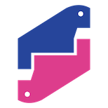
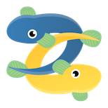

### Python駿河/Unagi.py
### 合同オンライン勉強会

<!-- logo -->

---

### 目的

- 静岡のPython使いの方々と交流
- 初学者から業務利用の方まで集まれる
- コミュニティ運営です

---

### 行動規範

[PyCon mini Shizuoka - 行動規範](https://shizuoka.pycon.jp/code-of-conduct/)

PyCon JPのCoCの準拠もお願いします

[行動規範 - PyCon JP 2020](https://pycon.jp/2020/code-of-conduct/)

- ハラスメント行為は止めましょう
<!-- - 連絡先はスタッフのSlackDM（メール準備中）へ連絡ください。 -->

---

### お子さまペットOK

- お子様やペットなどの映り込みOKです。ワイワイやりましょう。
- 女性参加のハードルを下げたい試み

---

### 写真撮影について

- 回の終わりに集合写真を取ります
- 顔写真を取られたくない方はカメラオフでお願いします
- 良ければカメラ/マイクオンで参加をお願いします
- にぎやかし枠の方は参加自由です

---

### Slackあります

ぜひご参加ください

- この勉強会の連絡手段はSlackを使います。
- ハンズオンやトークを行ったときの質問でも利用しています

- [Python駿河 Slack招待URL](https://join.slack.com/t/py-suruga/shared_invite/zt-811b9pwj-R_RbCmlTlV4B5iVKxF5gfA)
- [Unagi.py Slack招待URL](https://join.slack.com/t/unagi-py/shared_invite/zt-88t327i8-YHsIV~uWX313LPAaJDR9~Q)

---

### ハッシュタグ

ツイッターアカウントお持ちの方はぜひ感想などつぶやきお願いします

- Python駿河: #pysuruga
- Unagi.py: #unagipy（仮）

---

本日もよろしくお願いします！

---

<!-- 毎回の内容は以下より -->

---

### 本日の内容

Unagi.py #33 Python駿河 #17

2020/09/20（日）

---

### PyCon JP 2020 トーク振り返り

面白かった、まだ見ていないトーク/スライドを一緒に見ながら感想など色々言い合う会です

YouTube Liveを1.5倍速で流しながら見ていきます（個別に再生もOKです）

---

### スケジュール

- 20:00 オープニング
- 20:15 アイスブレイク/自己紹介
- 20:20 スタート
- 22:00 終了・オンライン懇親会

---

アンケートからの一覧

[スプレッドシートのまとめ](https://docs.google.com/spreadsheets/d/1VMVQ1qK_bhdrgThDCzUhTGA4qzzGQtp6hDyq-1FeGXI/edit?usp=sharing)

- キーノート２日目
- 野球選手の成績予測
- unittest.mock
- ソフトウェアRadio
- Sphinx
- PythonときどきRust
